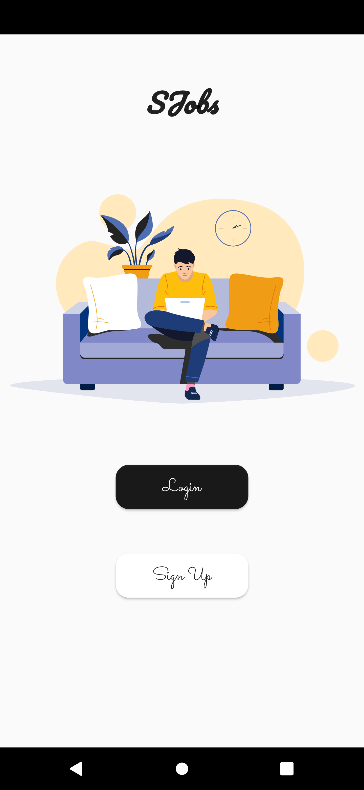
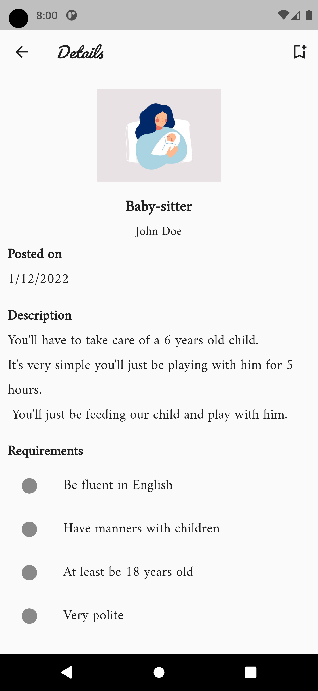

# SJobs

## Description

This project aims to provide an easier way for students to find a
job that will provide them some money. \
The idea is to provide services for those who need them. For example some baby-sitting, gardening and so on.

## Structure

The project is structured as follow:

```latex
+-- components => contains a widget organized by feature
+-- models
| +-- entities => domain entities classes
| +-- dtos => DTO classes
+-- providers => data repository using `riverpod`
+-- requests => requests generated using `dio`
+-- services => app services
+-- theme
| +-- app_theme.dart => main theme configuration
| +-- dark_theme_colors.dart => used color palette if the system is in dark mode
| +-- light_theme_colors.dart => used color palette if the system is in light mode
+-- utils => utility classes or functions
+-- views => the app's main views
| +-- common => views shared by both employers and students
| +-- employer => views reserved only for the employers
| +-- student => views reserved only for the students
```

## Preview

<div style="display:flex">



</div>

PS: each main view should start with a [Scaffold](https://api.flutter.dev/flutter/material/Scaffold-class.html) wrapped within a [SafeArea](https://api.flutter.dev/flutter/widgets/SafeArea-class.html).

- [riverpod docs](https://riverpod.dev/fr/)
- [dio docs](https://pub.dev/packages/dio)
